# Phase III: Software Design and Modeling

Project: **Blood Donation System**

Submission alignment reference: **Phase_III_Software_Design (1).pdf**

## 1. Software Architecture

### 1.1 System Architecture
The Blood Donation System is a role-based web application with three main stakeholders: **Donor**, **Blood Bank Staff**, and **Hospital Staff**.

High-level request flow:
1. A stakeholder performs an action on the frontend (browser UI).
2. The request is sent to a role-specific PHP page (controller-like layer).
3. The page validates session/role and input.
4. The page calls service-layer functions (`services/*_service.php`).
5. Service layer reads/writes the MySQL database via PDO.
6. The result is returned to the page.
7. The frontend renders feedback (success/error/data table/dashboard cards).

Example architecture flow (project-specific):
- Donor books appointment (Frontend).
- Request goes to `donor/book_appointment.php`.
- `donor_service.php` validates date/slot/conflicts.
- Database inserts appointment with `pending` status.
- Donor receives confirmation in dashboard/history.

### 1.2 Component Diagram (UML) — Quantity: 1
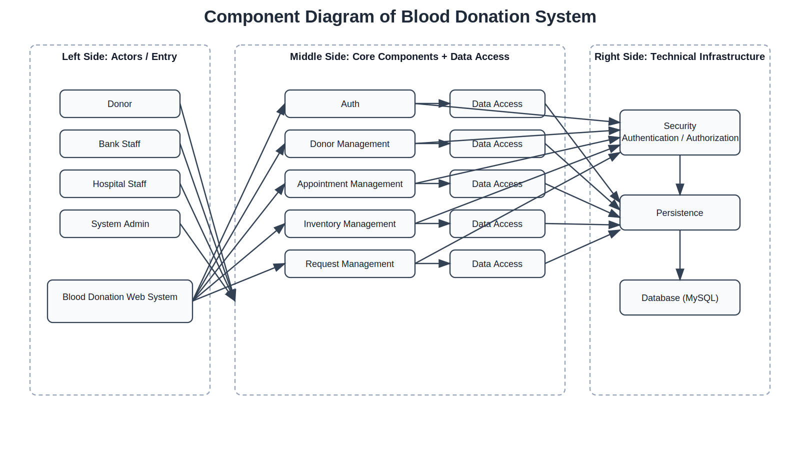

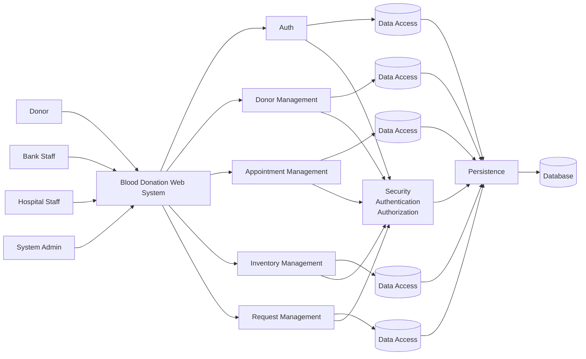
```mermaid
flowchart LR
    %% Left side: external actors / entry systems
    Donor[Donor]
    BankStaff[Bank Staff]
    HospitalStaff[Hospital Staff]
    Admin[System Admin]

    WebApp[Blood Donation Web System]

    Donor --> WebApp
    BankStaff --> WebApp
    HospitalStaff --> WebApp
    Admin --> WebApp

    %% Middle side: core application components
    Auth[Auth]
    DonorMgmt[Donor Management]
    Appointment[Appointment Management]
    Inventory[Inventory Management]
    Request[Request Management]

    WebApp --> Auth
    WebApp --> DonorMgmt
    WebApp --> Appointment
    WebApp --> Inventory
    WebApp --> Request

    %% Data access interfaces from middle components
    AuthDA[(Data Access)]
    DonorDA[(Data Access)]
    AppointmentDA[(Data Access)]
    InventoryDA[(Data Access)]
    RequestDA[(Data Access)]

    Auth --> AuthDA
    DonorMgmt --> DonorDA
    Appointment --> AppointmentDA
    Inventory --> InventoryDA
    Request --> RequestDA

    %% Right side: technical components
    Security[Security\nAuthentication\nAuthorization]
    Persistence[Persistence]
    Database[(Database)]

    Auth --> Security
    DonorMgmt --> Security
    Appointment --> Security
    Inventory --> Security
    Request --> Security

    AuthDA --> Persistence
    DonorDA --> Persistence
    AppointmentDA --> Persistence
    InventoryDA --> Persistence
    RequestDA --> Persistence

    Security --> Persistence
    Persistence --> Database
```

Component-side explanation (format requested):
- **Left side (Actors/System Entry):**
  - `Donor`, `Bank Staff`, `Hospital Staff`, `System Admin` interact with the `Blood Donation Web System`.
- **Middle side (Core Components):**
  - `Auth`: login, registration, role session checks.
  - `Donor Management`: donor profile and donor-facing operations.
  - `Appointment Management`: booking, approval, completion, cancellation.
  - `Inventory Management`: blood stock create/update/read.
  - `Request Management`: hospital blood request lifecycle.
  - Each core component calls a `Data Access` interface.
- **Right side (Technical Infrastructure):**
  - `Security`: authentication and access control concerns.
  - `Persistence`: database read/write handling.
  - `Database`: MySQL storage for users, donors, banks, hospitals, appointments, inventory, and requests.

## 2. Detailed Design

### 2.1 Class Diagram — Quantity: 1 (includes all major classes)
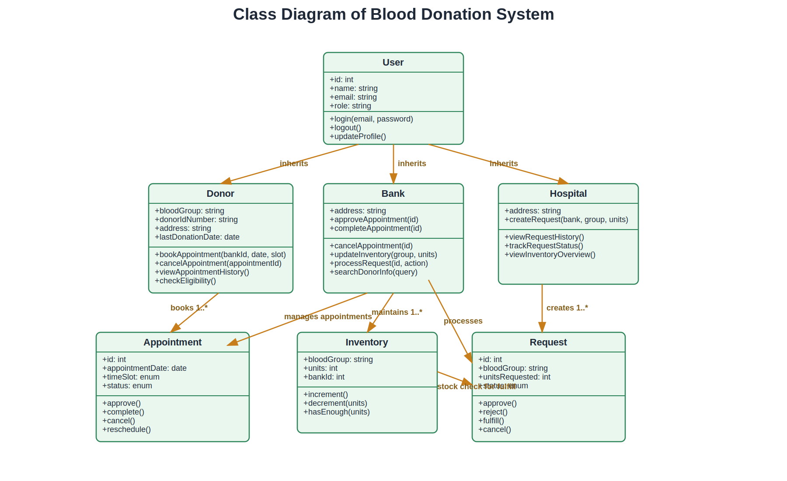

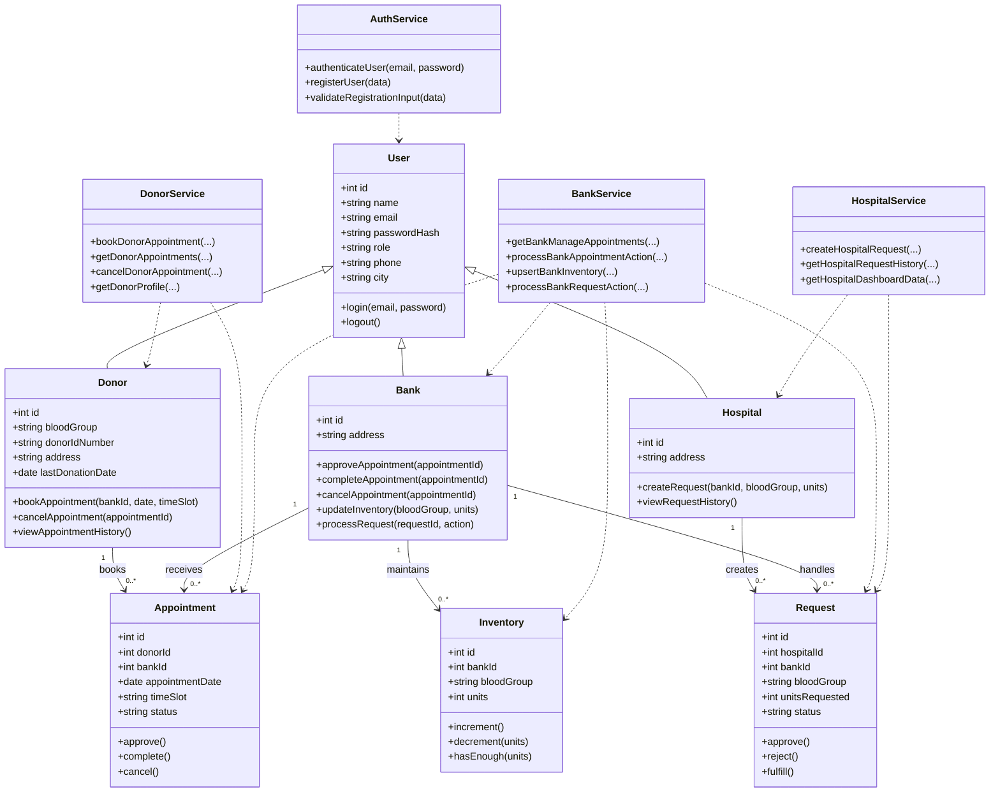
```mermaid
classDiagram
    class User {
      +int id
      +string name
      +string email
      +string passwordHash
      +string role
      +string phone
      +string city
      +login(email, password)
      +logout()
    }

    class Donor {
      +int id
      +string bloodGroup
      +string donorIdNumber
      +string address
      +date lastDonationDate
      +bookAppointment(bankId, date, timeSlot)
      +cancelAppointment(appointmentId)
      +viewAppointmentHistory()
    }

    class Bank {
      +int id
      +string address
      +approveAppointment(appointmentId)
      +completeAppointment(appointmentId)
      +cancelAppointment(appointmentId)
      +updateInventory(bloodGroup, units)
      +processRequest(requestId, action)
    }

    class Hospital {
      +int id
      +string address
      +createRequest(bankId, bloodGroup, units)
      +viewRequestHistory()
    }

    class Appointment {
      +int id
      +int donorId
      +int bankId
      +date appointmentDate
      +string timeSlot
      +string status
      +approve()
      +complete()
      +cancel()
    }

    class Inventory {
      +int id
      +int bankId
      +string bloodGroup
      +int units
      +increment()
      +decrement(units)
      +hasEnough(units)
    }

    class Request {
      +int id
      +int hospitalId
      +int bankId
      +string bloodGroup
      +int unitsRequested
      +string status
      +approve()
      +reject()
      +fulfill()
    }

    class AuthService {
      +authenticateUser(email, password)
      +registerUser(data)
      +validateRegistrationInput(data)
    }

    class DonorService {
      +bookDonorAppointment(...)
      +getDonorAppointments(...)
      +cancelDonorAppointment(...)
      +getDonorProfile(...)
    }

    class BankService {
      +getBankManageAppointments(...)
      +processBankAppointmentAction(...)
      +upsertBankInventory(...)
      +processBankRequestAction(...)
    }

    class HospitalService {
      +createHospitalRequest(...)
      +getHospitalRequestHistory(...)
      +getHospitalDashboardData(...)
    }

    User <|-- Donor
    User <|-- Bank
    User <|-- Hospital

    Donor "1" --> "0..*" Appointment : books
    Bank "1" --> "0..*" Appointment : receives
    Bank "1" --> "0..*" Inventory : maintains
    Hospital "1" --> "0..*" Request : creates
    Bank "1" --> "0..*" Request : handles

    DonorService ..> Donor
    DonorService ..> Appointment
    BankService ..> Bank
    BankService ..> Appointment
    BankService ..> Inventory
    BankService ..> Request
    HospitalService ..> Hospital
    HospitalService ..> Request
    AuthService ..> User
```

### 2.2 Sequence Diagrams — Quantity: 3

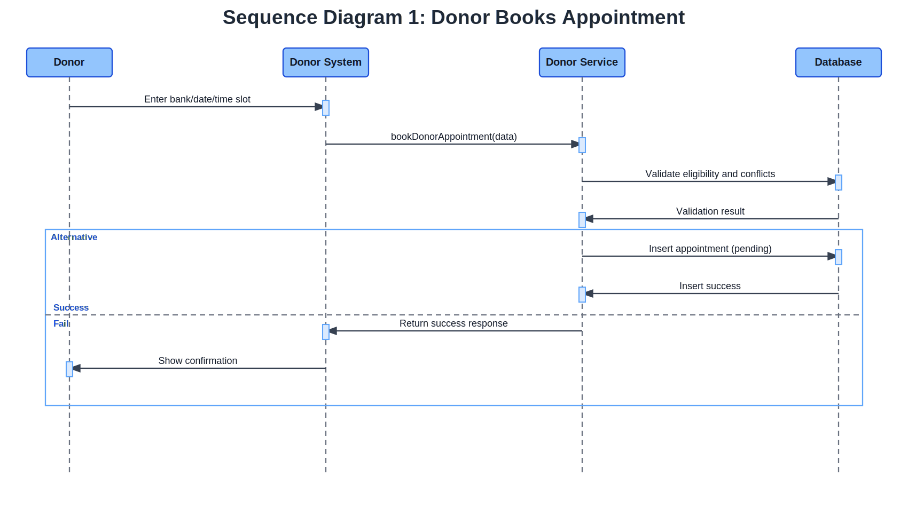

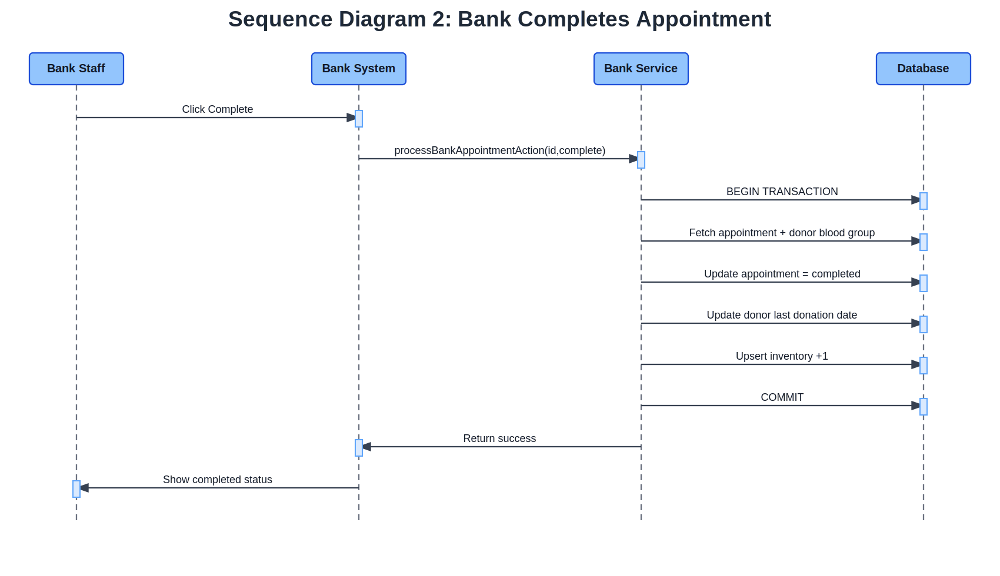

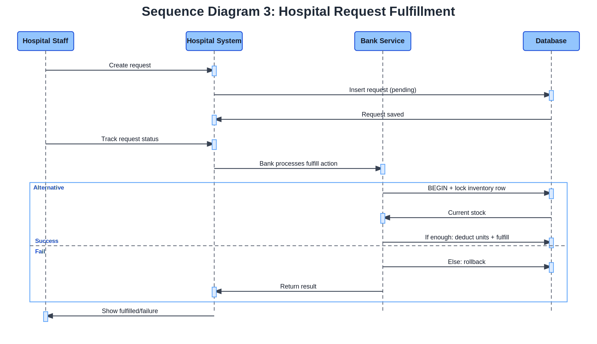

#### Sequence 1: Donor books appointment
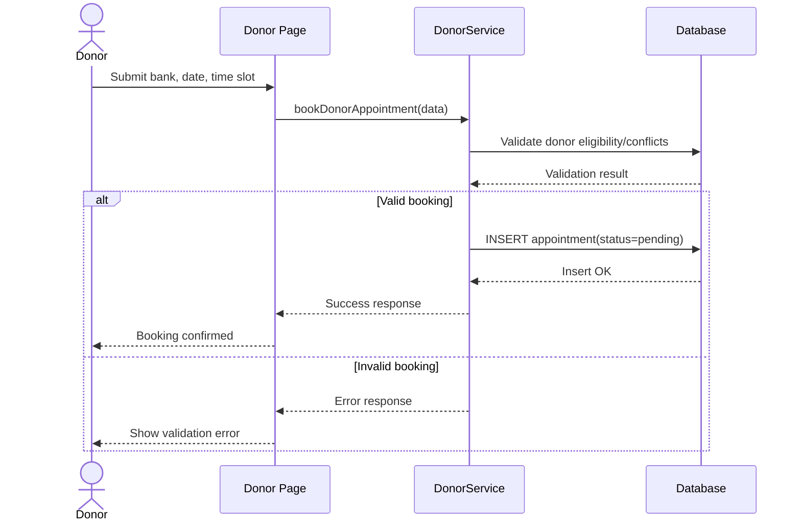
```mermaid
sequenceDiagram
    actor Donor
    participant UI as Donor Page
    participant DS as DonorService
    participant DB as Database

    Donor->>UI: Submit bank, date, time slot
    UI->>DS: bookDonorAppointment(data)
    DS->>DB: Validate donor eligibility/conflicts
    DB-->>DS: Validation result
    alt Valid booking
        DS->>DB: INSERT appointment(status=pending)
        DB-->>DS: Insert OK
        DS-->>UI: Success response
        UI-->>Donor: Booking confirmed
    else Invalid booking
        DS-->>UI: Error response
        UI-->>Donor: Show validation error
    end
```

#### Sequence 2: Bank completes appointment
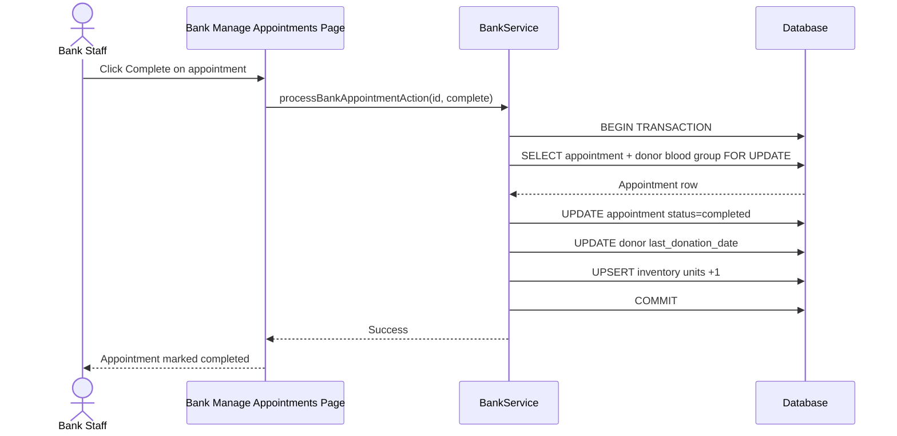
```mermaid
sequenceDiagram
    actor BankStaff as Bank Staff
    participant UI as Bank Manage Appointments Page
    participant BS as BankService
    participant DB as Database

    BankStaff->>UI: Click Complete on appointment
    UI->>BS: processBankAppointmentAction(id, complete)
    BS->>DB: BEGIN TRANSACTION
    BS->>DB: SELECT appointment + donor blood group FOR UPDATE
    DB-->>BS: Appointment row
    BS->>DB: UPDATE appointment status=completed
    BS->>DB: UPDATE donor last_donation_date
    BS->>DB: UPSERT inventory units +1
    BS->>DB: COMMIT
    BS-->>UI: Success
    UI-->>BankStaff: Appointment marked completed
```

#### Sequence 3: Hospital request fulfillment by bank
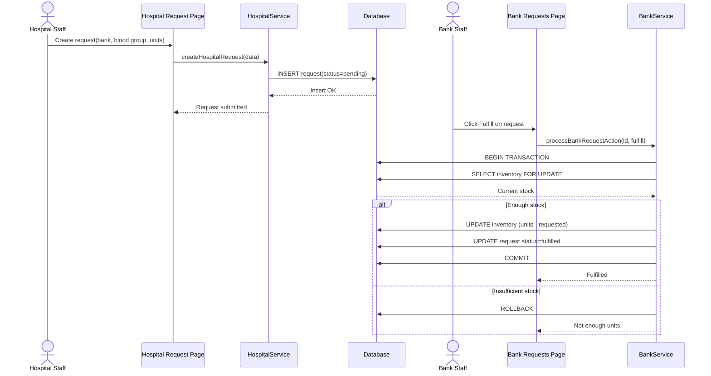
```mermaid
sequenceDiagram
    actor HospitalStaff as Hospital Staff
    participant HUI as Hospital Request Page
    participant HS as HospitalService
    participant DB as Database
    actor BankStaff as Bank Staff
    participant BUI as Bank Requests Page
    participant BS as BankService

    HospitalStaff->>HUI: Create request(bank, blood group, units)
    HUI->>HS: createHospitalRequest(data)
    HS->>DB: INSERT request(status=pending)
    DB-->>HS: Insert OK
    HS-->>HUI: Request submitted

    BankStaff->>BUI: Click Fulfill on request
    BUI->>BS: processBankRequestAction(id, fulfill)
    BS->>DB: BEGIN TRANSACTION
    BS->>DB: SELECT inventory FOR UPDATE
    DB-->>BS: Current stock
    alt Enough stock
        BS->>DB: UPDATE inventory (units - requested)
        BS->>DB: UPDATE request status=fulfilled
        BS->>DB: COMMIT
        BS-->>BUI: Fulfilled
    else Insufficient stock
        BS->>DB: ROLLBACK
        BS-->>BUI: Not enough units
    end
```

## 3. Modeling

### 3.1 Use Case Diagram — Quantity: 1 (all users included)
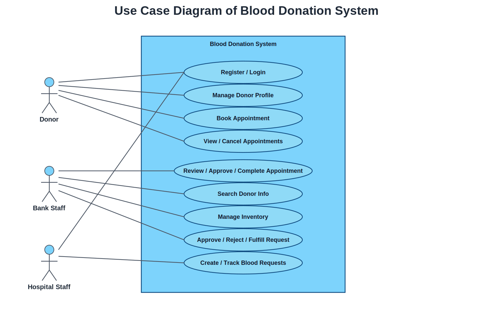

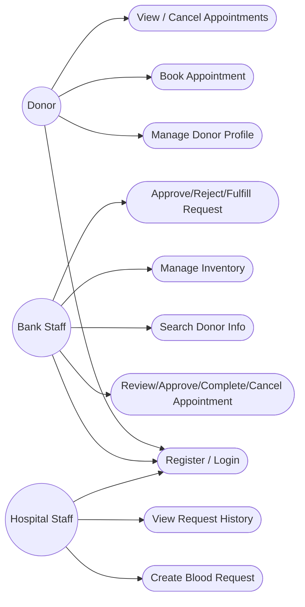
```mermaid
flowchart LR
    Donor((Donor))
    Bank((Bank Staff))
    Hospital((Hospital Staff))

    UC1([Register / Login])
    UC2([Manage Donor Profile])
    UC3([Book Appointment])
    UC4([View / Cancel Appointments])
    UC5([Review/Approve/Complete/Cancel Appointment])
    UC6([Search Donor Info])
    UC7([Manage Inventory])
    UC8([Create Blood Request])
    UC9([Approve/Reject/Fulfill Request])
    UC10([View Request History])

    Donor --> UC1
    Donor --> UC2
    Donor --> UC3
    Donor --> UC4

    Bank --> UC1
    Bank --> UC5
    Bank --> UC6
    Bank --> UC7
    Bank --> UC9

    Hospital --> UC1
    Hospital --> UC8
    Hospital --> UC10
```

### 3.2 Activity Diagrams — Quantity: 2

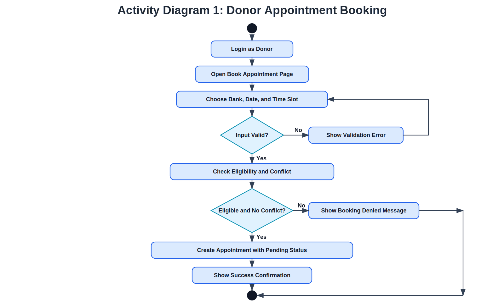

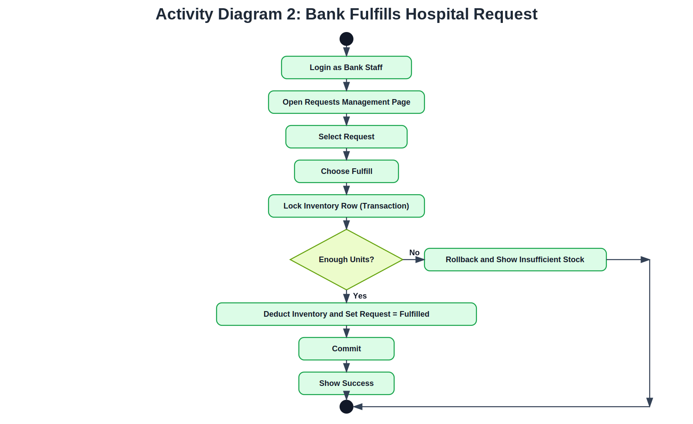

#### Activity 1: Donor appointment booking
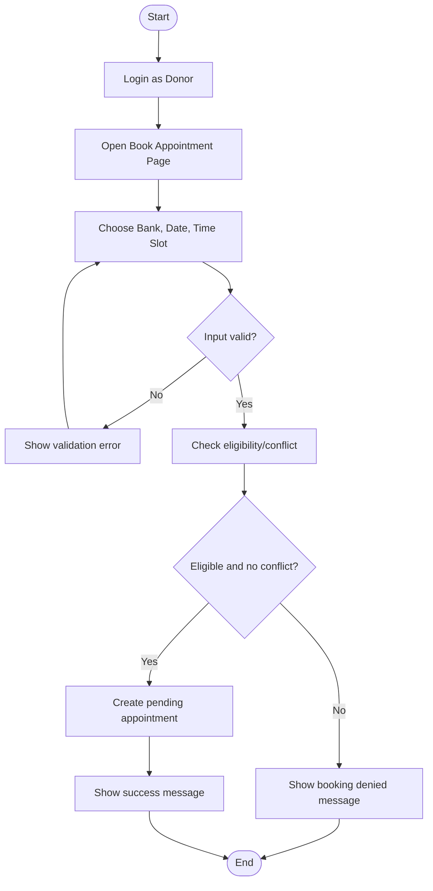
```mermaid
flowchart TD
    A([Start]) --> B[Login as Donor]
    B --> C[Open Book Appointment Page]
    C --> D[Choose Bank, Date, Time Slot]
    D --> E{Input valid?}
    E -- No --> F[Show validation error]
    F --> D
    E -- Yes --> G[Check eligibility/conflict]
    G --> H{Eligible and no conflict?}
    H -- No --> I[Show booking denied message]
    I --> J([End])
    H -- Yes --> K[Create pending appointment]
    K --> L[Show success message]
    L --> J([End])
```

#### Activity 2: Bank fulfills hospital request
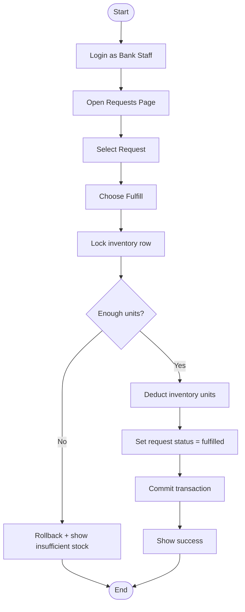
```mermaid
flowchart TD
    A([Start]) --> B[Login as Bank Staff]
    B --> C[Open Requests Page]
    C --> D[Select Request]
    D --> E[Choose Fulfill]
    E --> F[Lock inventory row]
    F --> G{Enough units?}
    G -- No --> H[Rollback + show insufficient stock]
    H --> I([End])
    G -- Yes --> J[Deduct inventory units]
    J --> K[Set request status = fulfilled]
    K --> L[Commit transaction]
    L --> M[Show success]
    M --> I([End])
```

### 3.3 State Diagrams — Quantity: 2

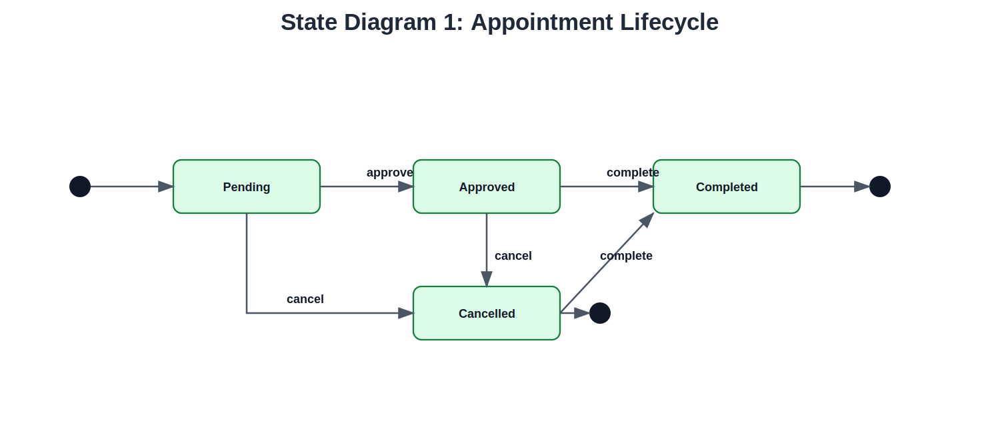

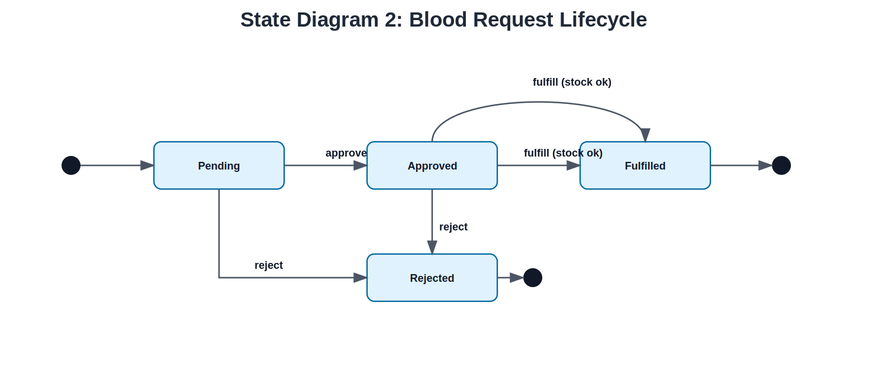

#### State Diagram 1: Appointment lifecycle
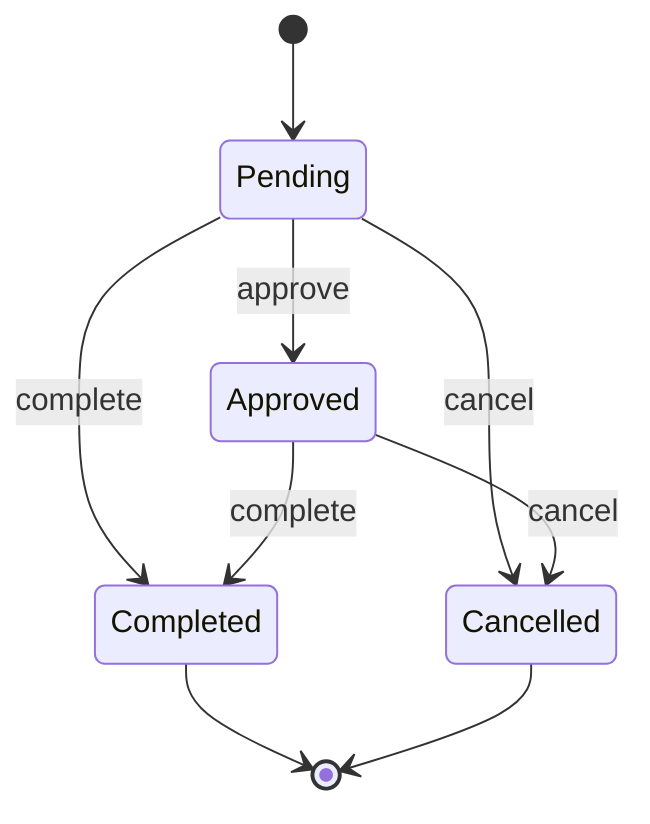
```mermaid
stateDiagram-v2
    [*] --> Pending
    Pending --> Approved: approve
    Pending --> Cancelled: cancel
    Pending --> Completed: complete
    Approved --> Completed: complete
    Approved --> Cancelled: cancel
    Completed --> [*]
    Cancelled --> [*]
```

#### State Diagram 2: Blood request lifecycle
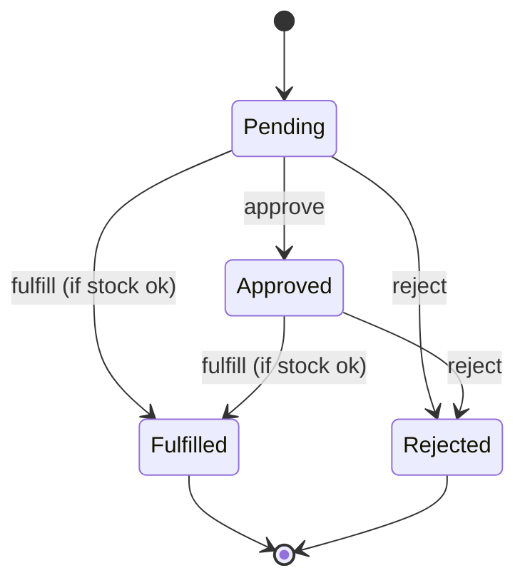
```mermaid
stateDiagram-v2
    [*] --> Pending
    Pending --> Approved: approve
    Pending --> Rejected: reject
    Pending --> Fulfilled: fulfill (if stock ok)
    Approved --> Rejected: reject
    Approved --> Fulfilled: fulfill (if stock ok)
    Fulfilled --> [*]
    Rejected --> [*]
```

